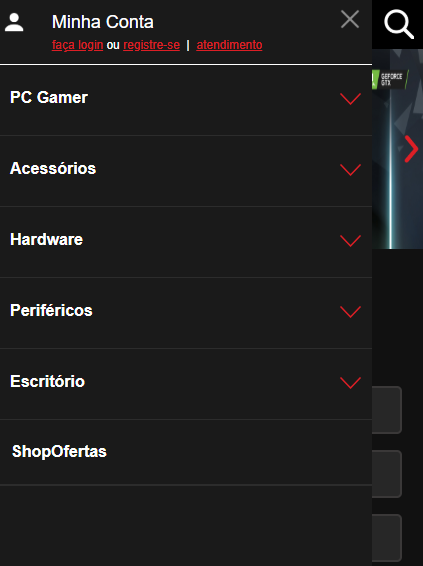

# Shopinfo Copy (It's in the beginning) 

[Link website](https://shopinfo-copy.000webhostapp.com/)

- Training HTML, CSS and testing Jquery and bootstrap - Shopinfo Copy
- This website is responsive up to 768px
```diff
- The images used are just temporary>
```
---
## Images
- <h2>Width: 425px</h2>
<div style="display: flex; justify-content: center">
 
 
 
</div>
- <h2>Width: 1440px</h2>
  <br/>
- <h2>Width: 1024px</h2>
  <br/>
- <h2>Width: 768px</h2>
  <br/>
 


---
## Contributors

- Raphael S. G. de Andrade <raphaelsatomiandrade@gmail.com>
